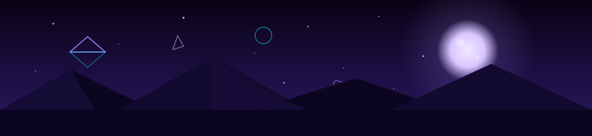

  

<h2 align="center">Tanishq Dabas — Data Scientist</h2>

  

I build systems that turn raw language into structured knowledge — RAG pipelines, fine-tuned transformers, and LLM agents that actually ship.

The receipts: a GenAI knowledge graph at EY that tamed 200+ banking terms and cut manual lookup by 45% · BERT fine-tuned at BEL's central research lab until false positives dropped 30% · a granted patent · a CRC Press/Routledge chapter · University Rank 1.

New Delhi, India.

  
  
  

### Stack

**Languages**

  
  

**ML / Deep Learning**

  
  
  
  

**GenAI / NLP**

  
  
  
  
  

**MLOps / Data**

  
  
  
  
  

### Now

- **Building** — production RAG pipelines and LLM agents for enterprise knowledge work
- **Learning** — RLHF and agentic workflows
- **Open to** — job hunting · research & collab offers · open-source contributors

### Featured work

| Project | Why it matters |
|---|---|
| [Fake News Detection](https://github.com/tanishqdabas/Fake-News-Detector-Streamlit-app-with-XGBoost-TF-IDF) | Ensembles beat the best single model by +3% — evidence published under CRC Press/Routledge, 2025 |
| [MindSync](https://github.com/tanishqdabas/Mindful-Space) | Student-wellbeing platform with a granted patent and 1,000+ students onboarded |
| [DreamForge](https://github.com/tanishqdabas/DreamForge) | Chains Gemini + a diffusion model into one reproducible pipeline — 10+ output formats per prompt chain |

  

  Profile updated: August 2026

